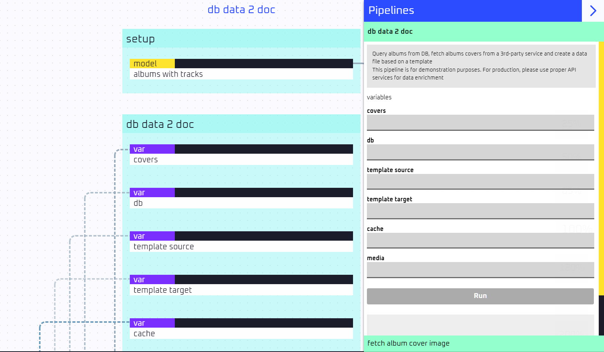

# EdgeOps Pro UMD

A performance-oriented automation engine, written from scratch and based on Mesh platform

## Two Minutes Setup

**Quick prefligh:**
* Before you begin, navigate to the [Mesh](https://github.com/edgeopspro/mesh/tree/%40v/1c) project, version `v/1c` (or above) and follow setup instructions
* Verify your `Mesh` installation and ensure everything works
* If you intend to run `UMD` app in development mode (recommended), ensure to install [Node.JS](https://nodejs.org/en/download) beforehand

**Now, the fun part:**

Go to `Mesh` working directory, locate `http.config.json` file and ensure that `http_srv` entry contains (at least) the followings:

```json
{
  "services": {
    ...
    "http_srv": {
      "host": "localhost",
      "port": 9886,
      "handshake": {
        "headers": {  <------  these headers will be present in every request in order to allow apps to properly communicate with our "Mesh" service
          "Access-Control-Allow-Origin": "http://localhost:9888",
          "Access-Control-Allow-Methods": "DELETE, GET, OPTIONS, PATCH, POST, PUT",
          "Access-Control-Allow-Headers": "Content-Type, Authorization, UMD-ENTRY, UMD-PIPE",
          "Access-Control-Max-Age": 86400
        }
      }
    },
    ...
  }
}
```

Then, locate `http.router.json` file and ensure the followings are inserted properly:

```json
{
  "http": {
    ...
    "/log/stream": [
      [],
      [ "log" ],
      []
    ],
    "/umd/engine": [  <------  this is where we declare our "UMD" operator (engine only)
      [],
      [ "umd.engine" ],
      []
    ]
  },
  "live": {
    "in": [ "log", "umd.engine" ],  <------  enable streaming capabilites for the "UMD" engine
    "out": [ "log" ]
  }
}
```

And... that's it! If all properly configured you are ready to run!

* Open a terminal windows and run `python http.srv.py` to run `Mesh` server (this is the `http` service)
* Open another terminal window and run `python op.engine.py` - this command will run our `UMD` operator
* Open a new terminal wind (yes, that's already the third terminal window) and run `python op.view.py dev` - in order to initiate the `UMD` app
* Open your browser and navigate to http://localhost:9888/



## How To Play Demo

The installation of `UMD` comes with a sample pipeline (for educational purposes only!) which demonstrates a variety of use-cases, including:
* Using a data model
* Orchestrate multiple steps
* Map and manipulate data
* Interact with local file system
* Use a sub-pipeline (very similar to a function, in order to simplify and re-use logic)
* Invoke `http` request

In order to play it, use your browser and fill in the following arguments inside the `db data 2 doc` pipeline:

| Argument         | Value                 |
| :--------------- | :-------------------- |
|  covers          | albums-cover.json     |
|  db              | demo.sqlite           |
|  template source | catalog.template.md   |
|  template target | my music catalog.md   |
|  cache           | cache                 |
|  media           | media                 |

Hit the `Run` button, wait a couple of seconds and inspect the log (just kidding). The final result is a file named `my music catalog.md` inside `bin/gen` folder.
This file shows a portion of the data from a [sample DB](https://github.com/lerocha/chinook-database) mixed with content retrieved from the web (images)

## How To Use UMD Engine

First and foremost, `UMD` engine is an automation-oriented platform, meaning: every action can be automated. *For instance:* the demo pipeline can be invoked via an `API request`

```http
POST /umd/engine HTTP/1.1
Host: localhost:9886
UMD-ENTRY: demo
UMD-PIPE: db data 2 doc
Content-Type: application/json
Content-Length: 205

{
    "covers": "albums-cover.json",
    "db": "demo.sqlite",
    "template source": "catalog.template.md",
    "template target": "my music catalog.md",
    "cache": "cache",
    "media": "media"
}
```

Second, `UMD` engine was built with modern patterns and best practices in mind. This is why, in its core, the entrie engine is using tools. You can add your own tools and logic or re-configure your instance `toolkit` by editing the `op/engine/toolkit.py` file

If you wish to initiate a new pipeline, all you have to do is to create a proper `UMD` file inside the `op/engine/umds`. That's it!
As demonstrated, if you wish to use hooks (`pre` - before the pipeline run, `proc` - while the pipelie is running, `post` - after pipeline run) - you can add a `python` file (with the same name as the `UMD` file) in order to customize and control the entire process

**Thecnical notes**:
* When editing a `UMD` file it is crucial to restart the `UMD` engine operator in order to reflect changes |
* When using IDs - please ensure that every `id` is unique (as the entire folder of `umds` is flattened into a single file) |